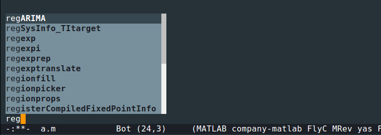
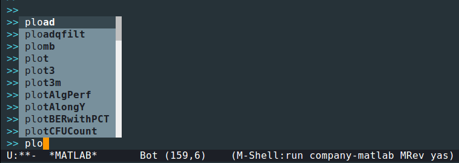
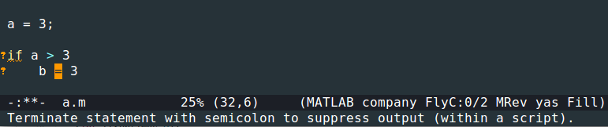

# matlab-mode

An emacs matlab mode based on the [classic one](http://matlab-emacs.sourceforge.net/).

## Warning
1. First use or open ```.m``` file can be slow because it needs to open a background matlab process.
2. You need to set ```matlab-server-executable``` to where your matlab exec.

## Highlights

1. A company-mode backend



2. A flycheck backend


3. Easy to view document of word at cursor (default keybinding: <kbd>Ctrl-c</kbd> + <kbd>h</kbd>).

4. Jump to definition (default keybinding: <kbd>Ctrl-c</kbd> + <kbd>s</kbd>).
Currently, this only helps open the souce file (can not go to the definition of the function).
If it does not work, it may be becasue you have not added the file's folder into matlab workspace.

## Install

1. Install dependencies like ```s.el```, ```flycheck``` and ```company-mode```.
2. Copy the code to somewhere
3. Add the following to the initialization file

```elisp
(setq matlab-server-executable "/path/to/matlab/binary")
(add-to-list 'load-path "/path/to/matlab-mode/")
(require 'matlab-mode)
(matlab-mode-common-setup)
```

## Usage
To use the functionalities, one must first run <kbd>M-x</kbd> ```matlab-start``` to start the background process.
Since matlab is a bit slow to start, you may need to wait a few seconds.

## Recommendation
Recommend to turn-off automatic complete in company-mode and do the completion when needed.

## Copyright

```matlab.el``` is mostly copied from the ["classic" matlab mode](http://matlab-emacs.sourceforge.net/).

## TODO

1. debug?
